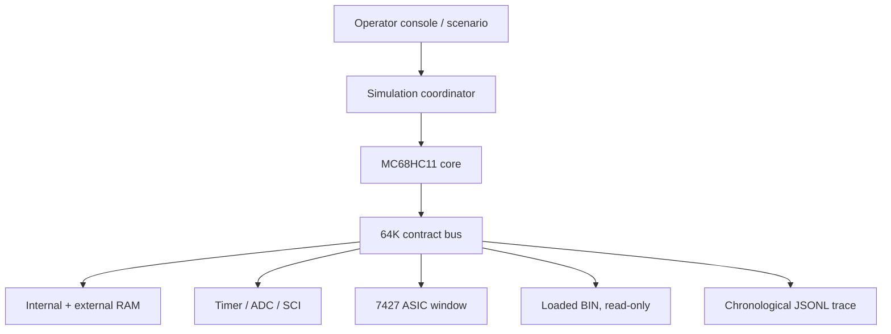

# HAC31 ROM Simulator

A contract-driven MC68HC11 simulator for the GM `16197427` (`7427`) `$31` PCM. It loads and executes an actual 64K/48K/32K BIN, maintains the CPU memory map and working RAM, models selected HC11/7427 devices, accepts operator-controlled inputs, and records the code-to-hardware path.

This first build is anchored to `snow663/7427HWContract` commit `c902ff4c53356c089cefa8f92263454e960bf667`. The repository contract outranks HAC comments. Optional HAC HTML labels are displayed as `hac_hint`; they never silently become device behavior.

## What works now

- Real BMHM reset execution: `$FFFE -> $FC29 -> $7100`.
- Flat 64K address space with HC11 internal RAM/register relocation through `INIT`.
- Stock `$31` 2.097152 MHz E-clock and E/32 ASIC timing domain.
- HC11 instruction execution, instruction stepping, cycle-budget running, breakpoints, and interrupts.
- Functional timer subset: `TCNT`, output compares, masks, write-one-clear flags, and vectors.
- Four-result HC11 ADC with a 32-cycle conversion delay.
- Reference-pulse/IRQ generation from RPM using the contract formula `3FC0 = round(983040 / RPM)`.
- Contract-named fuel, spark, scheduler, I/O-latch, and unknown `$306x` output events.
- Scripted input and memory events by cycle.
- Chronological streaming JSONL containing bus accesses, outputs, and scenario/interrupt events.
- ROM write protection; deliberate debugger patches require the separate `patch` command.
- Stock `BMHM.BIN` and current `2.bin` SHA-256 identity recognition.

## Authority and uncertainty

The profile keeps evidence attached to every named device access:

| Tag | Meaning |
|---|---|
| `contract_high` | High-confidence source/dataflow contract in the repo; not automatically physical proof. |
| `contract_test_item` | Address/access is real, but physical semantics or necessity remain unresolved. |
| `hac_source_hint` | Optional disassembly label/comment only. |
| `modeled` | Simulator behavior awaiting comparison with a real trace or bench capture. |
| `bench_proven` | Reserved for behavior that passes the repo's bench gate. |

High-level `MAP`, `TPS`, coolant, battery, and VSS settings annotate the trace. They are not guessed into ADC channels. Raw `adc.0` through `adc.7`, port values, `$3FFA`, and unknown `$306x` registers stay explicit until their bindings are proven.

## Architecture



The major pieces are intentionally separate:

- `romsim/hc11_core.py` — CPU execution and instruction timing.
- `romsim/bus.py` — all memory accesses, relocation, ROM protection, and rich access tracing.
- `romsim/devices.py` — engine inputs, ADC, timer, and external ASIC timing.
- `romsim/contracts.py` — evidence-bearing PCM profile loader.
- `romsim/scenario.py` — deterministic cycle-scheduled input changes and interrupts.
- `romsim/simulator.py` — execution control, breakpoints, interrupts, BIN identity, and coordination.
- `romsim/cli.py` — batch interface and interactive operator console.

## Run it

No third-party Python packages are required.

```bash
cd hac31_romsim
python3 -m unittest discover -s tests -v
python3 -m romsim /path/to/BMHM.BIN --steps 100000
python3 -m romsim /path/to/2.bin --scenario examples/key_on_to_idle.json --repl
```

Load the supplied HAC view only for visibly tagged source annotations:

```bash
python3 -m romsim /path/to/BMHM.BIN \
  --hac-html /path/to/31_HAC_from_ORG_7100_to_end_NOWRAP.html \
  --repl
```

Capture the entire chronological run without the in-memory trace limit:

```bash
python3 -m romsim /path/to/BMHM.BIN \
  --scenario examples/key_on_to_idle.json \
  --cycles 500000 \
  --trace-out bmhm_trace.jsonl
```

Useful console commands:

```text
step 1
cycles 100
run 50000
break 0x8426
obreak 0x3FCE
set rpm 800
set adc.7 192
poke 0x3FFA 0x20
outputs 20
bus 20
save-trace session.jsonl
```

## Timing boundary

The CPU currently commits each instruction atomically. Instruction cycle counts advance the HC11 timer, ADC, reference generator, and scenario clock, and `cycles N` stops on the first completed instruction boundary at or beyond the requested budget. Bus accesses inside one instruction retain their correct order but share the instruction-start cycle. A future micro-operation core can replace `hc11_core.py` without changing the bus, devices, scenarios, or operator interface.

That makes this build useful for deterministic algorithm/dataflow execution, address ownership, state progression, branch behavior, output handoffs, and coarse timing. It does not yet claim E-pin-exact intra-instruction waveforms or a physically complete ASIC.

## Real-ROM smoke test

```bash
python3 tools/smoke_real_bin.py /path/to/BMHM.BIN --instructions 100000
```

The expected stock digest is:

```text
6188975246cf0042979f3a1694e3d43a2985a1452e7547a3b9e8a66d10e65004
```

The current truck `2.bin` digest recorded by the repo is:

```text
2387d708c8d4cc82b78fabda579e48b7daef79f331543a54b669b70b6262877e
```

## Next fidelity gates

1. Replay a captured key-on/crank/idle trace and compare PC/address/value order.
2. Replace manual `$3FFA` and `$306x` values only as each bit/register earns a contract.
3. Add exact timer-pin output action from `TCTL1` and compare sequencing at `$301C/$301E/$3020/$3022/$3023`.
4. Bind ADC mux selections to physical sensors using the repo's sensor semantic validation work.
5. Convert the CPU to micro-operations for true E-clock/pin-level stepping.
6. Add ALDL live-dereference serialization timing so virtual rows reproduce field-order skew.

